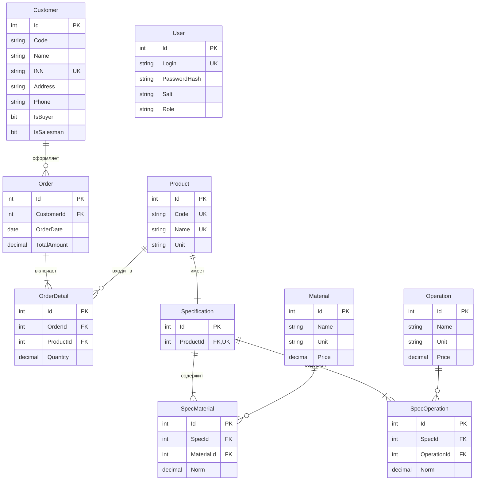

# Раздел 3. ER-диаграмма базы данных

**Тема:** Автоцентр «Плюс». База данных: AutoCenterPlusDB

## 3.1. Сущности и атрибуты

| Сущность | Атрибуты | Комментарий |
|---|---|---|
| Customer (Заказчик) | Id (PK), Code, Name, INN (UNIQUE), Address, Phone, Email, IsBuyer, IsSalesman, CreatedAt | Справочник контрагентов из Заказчики.json |
| Product (Продукция) | Id (PK), Code (UNIQUE), Name (UNIQUE), Unit | Работы/услуги автоцентра |
| Material (Материал) | Id (PK), Name, Unit, Price | Запчасти и расходники |
| Operation (Технологическая операция) | Id (PK), Name, Unit, Price | Нормо-часы работ |
| Specification (Спецификация) | Id (PK), ProductId (FK, UNIQUE) | 1:1 с продукцией |
| SpecMaterial (Материалы спецификации) | Id (PK), SpecId (FK), MaterialId (FK), Norm | M:N через ассоциативную таблицу |
| SpecOperation (Операции спецификации) | Id (PK), SpecId (FK), OperationId (FK), Norm | M:N через ассоциативную таблицу |
| Order (Заказ) | Id (PK), CustomerId (FK), OrderDate, TotalAmount | Заказ покупателя |
| OrderDetail (Позиция заказа) | Id (PK), OrderId (FK), ProductId (FK), Quantity | M:N: Order ↔ Product |
| User (Пользователь) | Id (PK), Login (UNIQUE), PasswordHash, Salt, Role, FullName | Аутентификация, RBAC |

## 3.2. Связи между сущностями

| Связь | Тип | Ограничение |
|---|---|---|
| Customer → Order | 1:M | Один заказчик — много заказов |
| Order → OrderDetail | 1:M | Каскадное удаление позиций |
| Product → OrderDetail | 1:M | Позиция ссылается на продукцию |
| Product → Specification | 1:1 | UNIQUE(ProductId) |
| Specification → SpecMaterial | 1:M | Каскадное удаление |
| Specification → SpecOperation | 1:M | Каскадное удаление |
| Material → SpecMaterial | 1:M | UNIQUE(SpecId, MaterialId) |
| Operation → SpecOperation | 1:M | UNIQUE(SpecId, OperationId) |

## 3.3. Диаграмма (Mermaid)

## 3.4. Приведение к 3НФ

- **1НФ:** все атрибуты атомарны, повторяющиеся группы вынесены в таблицы SpecMaterial/SpecOperation (нормы), OrderDetail (позиции заказа).
- **2НФ:** каждый неключевой атрибут полностью зависит от PK; ассоциативные таблицы имеют составную уникальность (SpecId, MaterialId/OperationId).
- **3НФ:** отсутствуют транзитивные зависимости: цена хранится только в Material/Operation (а не дублируется в спецификации), данные клиента — только в Customer.

## 3.5. Выводы по разделу

ER-модель из 10 таблиц полностью покрывает предметную область: связь «заказ — позиции — продукция — спецификация — материалы/операции» позволяет рассчитывать полную стоимость заказа на основе норм расхода. Модель реализована в MS SQL Server (Раздел 4, файл 02_CreateTables.sql).